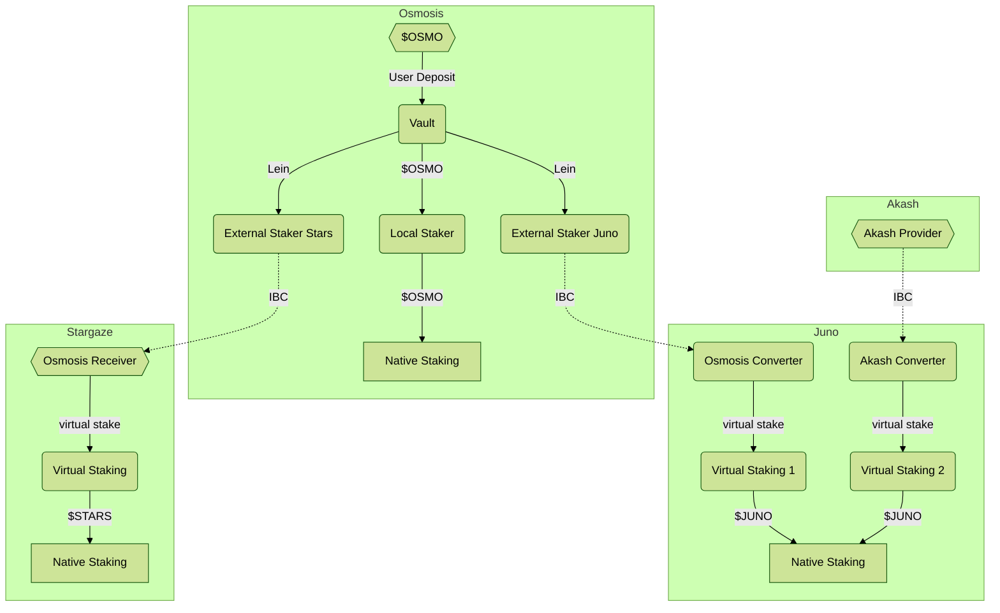

# Mesh Security Architecture

This is an architectural overview of the various components of Mesh Security.
These attempt to explain a full-refined v2 state. As needed, we will include
simplifications used for MVP (testnet) or v1 (production-ready, feature-limited)
as footnotes in the documents.

You can get a good overview of the whole system flow in the above diagram. 
The design should allow one chain to provide security to multiple chains, while
at the same time receiving security from multiple chains. 

A key to understanding the design, is that the whole system is _delegator-centeric_ 
not _validator-centric_. This means that we don't try to match the same validators on
multiple chains, or even subsets, but rather focus on leveraging the security
provided by staking tokens to secure validators on multiple chains.  This provides a way to
scale bidirectionally, while avoiding some sort of infinite-loop recursion, as
chains can only provide security in their native token(s).

## Use Cases

Before we dig into the architecture of Mesh Security, please take a look at
the [use cases we aim to serve](./UseCases.md).

## Definitions

* **Pairing** - a trust relationship between two chains, such that one promises to lock up slashable
  stake, while the other leverages this promise to issue validation power in the dPoS system.
  Notably, chain A and chain B may have two pairings in opposite directions at the same time.
* **Provider** _(also "Provider Chain")_ - when looking at one pairing, this is the chain which 
  locks up tokens and provides them as staking collateral to the other chain. 
* **Consumer** _(also "Consumer Chain")_ - when looking at one pairing, this is the chain which
  adjusts validator weights and provides rewards based on remote collateral.
* **Collateral** - Tokens locked up on the provider chain, which are providing security
  guarantees to one or more providers. These tokens may be slashed upon any slashing event
  in the consumers.
* **Staking** _(also "Delegation")_ - The act of providing collateral for a validator, such that the
  staker receives a portion of the block rewards if they behave correctly, as well as the slashing risk
  if they misbehave.
* **Unstaking** _(also "Unbonding")_ - The act of initialing the removal of stake from a system. During
  the "unbonding period", the collateral will not receive any rewards, but will be liable to slashing
  based on misbehavior of that validator.
* **Unbonding period** - The time delay between initiating unbonding and having free access to the
  underlying collateral. Once this time has passed after unstaking, all claims on the underlying
  collateral are released and 
* **Rewards** - Block rewards are issued to validators in the native token of the consumer chain.
  A portion of these rewards goes to the stakers and is collected cross-chain.
* **Slashing** - If a validator misbehaves, the tokens delegated to it, which provided the
  voting power, can be slashed. The percentage of slashing for each misbehavior depends on the chain.
  This slash must be reflected by stakers on the provider chain, but we may make some approximations
  as needed to implement this efficiently.
* **Jailing** - If a validator misbehaves, it may be jailed, or removed from the validator set and
  prevented from returning. Tokens staked to it would be partially slashed and should be unstaked
  as soon as possible, as they will receive no more rewards. Stake to a jailed validator still must
  wait the unbonding period to be liquid.
* **Latency** - Time delay from an action being initiated and the effects being reflected in
  another contract or chain. This doesn't refer to the unbonding period, but rather the delay between
  initiating bonding or unbonding on the provider and the equivalent action occurring on the consumer. 

## Sections

Below are links to detailed documents on various sub-systems:

[Provider](./provider/Provider.md):
  * [Vault](./provider/Vault.md)
  * [Local Staking](./provider/LocalStaking.md)
  * [External Staking](./provider/ExternalStaking.md)
  * TODO - Rust interfaces

[Consumer](./consumer/Consumer.md):
  * [Converter](./consumer/Converter.md)
  * [Virtual Staking](./consumer/VirtualStaking.md)
  * SDK Changes

[IBC Protocol](./ibc/Overview.md):
  * [Cross-Chain Staking](./ibc/Staking.md)
  * [Reward Flow](./ibc/Rewards.md)
  * [Handling Slashing Evidence](./ibc/Slashing.md)
  
## Limitations

**Unbonding Limits**

As we are focused on the standard implementation of the Cosmos SDK, one account may only have
a fixed number of simultaneous unbondings on a given delegator. By default, that number is 7.
We must batch together multiple unbonding requests so there are never more than that number
active at once. The typical solution for LSDs is to divide the unbonding period into segments,
so if the unbonding period is 3 weeks, the contract initiates unbonding every 3 days for all
requests that occurred in that period.
