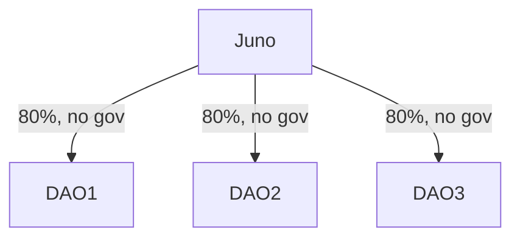
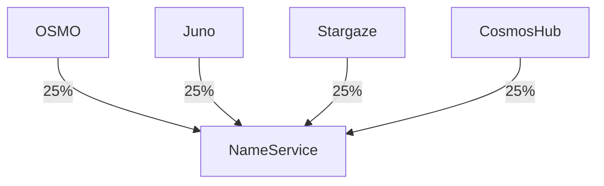

# Use Cases

## DAOs migrating to own chain

A number of Juno DAOs launching their own chains. They want to inherit most of their security from Juno,
but keep governance to their own token.

## Credibly Neutral Common Good

There are some items that should be neutral or independent of multiple chains,
like a shared name service. In this case, we allow multiple controlling chains to 
control the staking and governance, even without any native staking power.

