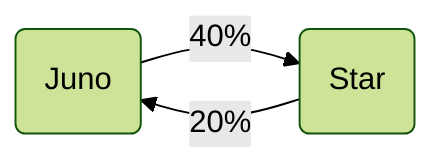
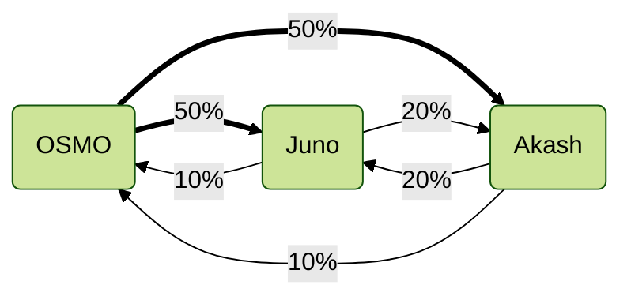
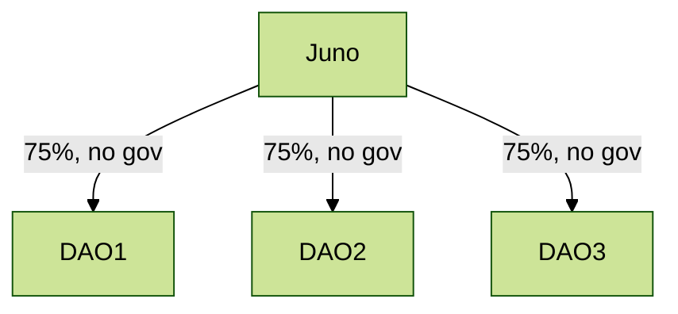
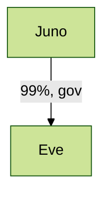
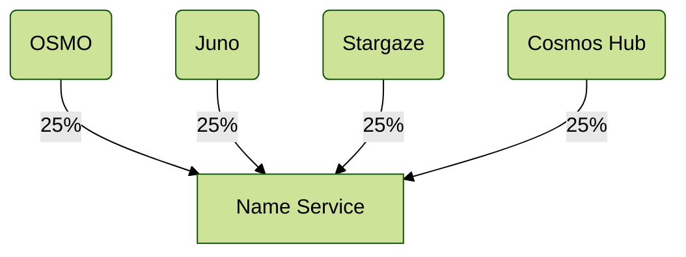

# Use Cases

## Sibling Chains

Two chains of similar size want to support each other.
There can be a difference of the strength, such that
larger -> smaller has more weight than smaller -> larger.

## Full Mesh

This is meant for multiple chains with market caps within
say an order of magnitude that all have supportive relations
and want to enter a joint security zone. They can all provide meaningful levels of security
to each other. This leads to many bidirectional flows and
even loops (yes, the algorithm handles this).

Note that Osmosis is about 5x the size of the other two,
so the weights are proportional to their relative market caps.

## DAOs migrating to own chain

A number of Juno DAOs launching their own chains. They want to inherit most of their security from Juno,
but keep governance to their own token.

## Almost Replicated Security

Mesh Security is not ICSv1 "Replicated Security". We do not map validators from provider to consumer, but rather delegators.
And the power is the subset of staked tokens that opt-in, so will always be lower than full stake. By design we always require
a native staking token in the consumer chain, but we can approximate "replciated security" for the "fully owned subsidiary"
use case.

You can launch a chain with a governance token with minimal distribution to bootstrap the chain. Then accept another chain as a
provider, locking it's token 1:1 with the native token (hardcoded "oracle" feed), and allow it to control up to 99% of the voting power
of the chain, including gov votes. The end effect is the new chain is almost 100% controlled by the cross-stakers of the parent chain:

## Credibly Neutral Common Good

There are some items that should be neutral or independent of multiple chains,
like a shared name service. In this case, we allow multiple controlling chains to 
control the staking and governance, even without any native staking power.

