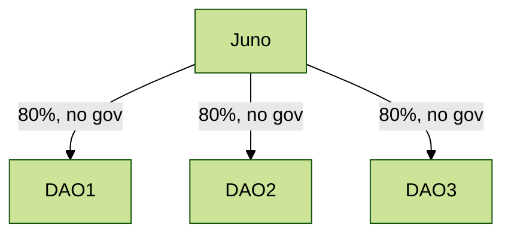

# Use Cases

## DAOs migrating to own chain

A number of Juno DAOs launching their own chains. They want to inherit most of their security from Juno,
but keep governance to their own token.

## Credibly Neutral Common Good

There are some items that should be neutral or independent of multiple chains,
like a shared name service. In this case, we allow multiple controlling chains to 
control the staking and governance, even without any native staking power.

## Sibling Chains

Two chains of similar size want to support each other.
There can be a difference of the strength, such that
larger -> smaller has more weight than smaller -> larger.

## Full Mesh

This is meant for multiple chains with market caps within
say an order of magnitude that all have supportive relations
and want to enter a joint security zone. They can all provide meaningful levels of security
to each other. This leads to many bidirectional flows and
even loops (yes, the algorithm handles this).

Note that Osmosis is about 5x the size of the other two,
so the weights are proportional to their relative market caps.

