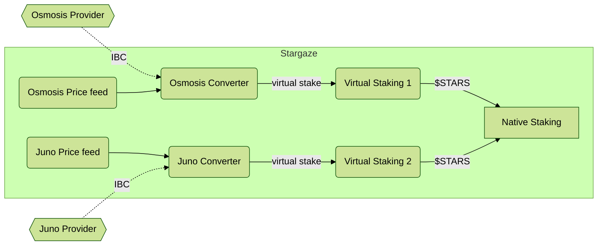

# Consumer

The consumer side of the system receives "virtual tokens" from
some trusted providers and uses those to update the local staking weights.
It then provides rewards to those providers in exchange for
the security promise it receives.

This is the other half of [the provider flow](../provider/Provider.md)

## Converting Foreign Stake

Not all providers are treated equally. (And this is a good thing)

Each Converter accepts messages from exactly one provider and is
the point where we establish trust. The Converter is responsible for
converting the staking messages into local units. It does two transformations.
This first is convert the token based on a price oracle. The second step is to apply a discount, 
which captures both the volatility of the remote asset, as well as
a general preference for local/native staking.

This is described [more in depth under Converter](./Converter.md#staking-flow).

##  Virtual Staking

Once the Converter has normalized the foreign stake into the native staking units,
it calls into the associated ["Virtual Staking" contract](./VirtualStaking.md) in order
to convert this into real stake without owning actual tokens. This contract must be
authorized to have extra power in a native Cosmos SDK module to do this impact, and has
a total limit of tokens it can stake. It performs 3 high level tasks:

* Staking "virtual tokens" as requested by the Converter (up to a limit)
* Periodically withdrawing rewards and sending them to the Converter
* Unstaking "virtual tokens" as requested by the Converter. This must be immediate and
avoid the "7 concurrent unbonding" limit on the `x/staking` module to be properly usable.

## Handling Failures

**TODO**

Explain how this system limits systemic failures in a few cases.
(Does this section belong here? Or in a higher level doc?)

Price issues:

* Foreign Provider price moons (Existing stake hits the max cap)
* Foreign Provider price crashes (Usually accounted by discount, generally should not get more power staking
$1 of foreign tokens than $1 of local tokens)
* Consumer price crashes (All providers get better conversion, but limited by max cap)

Byzantine Actors:

* Foreign Provider goes Byzantine (okay as long as their max cap is less than circa 30% of total stake)
* Consumer goes Byzantine (Can force unbond, withhold rewards, but not slash or permanently lock up tokens)
