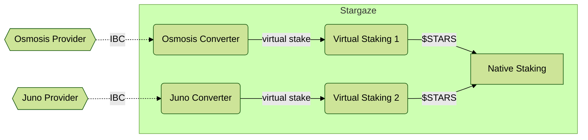

# Consumer

The consumer side of the system receives "virtual tokens" from
some trusted providers and uses those to update the local staking weights.
It then provides rewards to those providers in exchange for
the security promise it receives.

This is the other half of [the provider flow](../provider/Provider.md)

## Weighting of Providers

Not all providers are treated equally. (And this is a good thing)

Each Receiver accepts messages from exactly one provider and is
the point where we establish trust. The Receiver is responsible for
normalizing the stake into local units. It does two transformations.
This first is convert the token based on a price oracle. (For example,
if we are sent 1000 JUNO, we convert to 1200 OSMO based on some oracle, for example
TWAP feed updated daily).

The second step is to apply a discount, which captures both the volatility of the remote asset
(discount should be greater than any expected change between oracle feed updates), as well as
a general feeling that $1000 of remote assets shouldn't have the same power as $1000 of native
assets. For example, the Receiver is configured with a 50% discount for the JUNO provider,
and thus those 1000 JUNO actually turn into 600 OSMO of "virtual stake".

By itself, a Receiver cannot impact the local staking system.  It must connect to the _Meta-Staking_ system,
which will convert the "virtual stake" into actual stake in the dPoS system, and produce the rewards as well.
The _Meta-Staking_ system is a permissioned contract that can access custom Cosmos SDK functionality
to mint virtual tokens, which it then staked on the Receiver's behalf.

We cannot let any receiver mint arbitrary tokens, or we lose all security, so each receiver has permission
of a maximum amount of "virtual stake" that it can provide to the system. Anything over that is ignored,
after which point, the average rewards per cross-staker start to diminish as they split a limited resource.

The allow list in the Meta-Staking contract to manage the value of various Receivers is of critical importance
for the security design of Mesh Security. Not all remote chains are treated equally and we need to be selective
of how much security we allow to rest on any given token

**TODO** links to more details

## Handling Failures

**TODO** explain how this system limits systemic failures in a few cases.
(Does this section belong here? Or in a higher level doc?)
