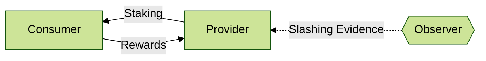

# IBC Protocol

Mesh Security is fundamentally an interchain-protocol,
and it is important to define the exact mechanics of
how the different subsystems interact.

Here were are focusing just on the dotted lines, that
we abstracted away when focusing on [Providers](../provider/Provider.md)
and [Consumers](../consumer/Consumer.md).

Fundamentally there are these two flows, although slashing
is also done cross chain, but outside of IBC (by external observers).
For the time being, we focus on the two IBC data flows
and discuss cross-chain slashing in another section.

## Deployment

As mentioned in [the consumer section](../consumer/Consumer.md),
we need to establish a trust relationship between the
Provider side and the Consumer side. This is done in multiple stages.

Establish a channel (allow list):

1. Admin deploys _Receiver_ on Consumer side.
2. Admin deploys _External Staker_ on Provider side, registering (connection, port) from _Receiver_ contract from (1)
3. Admin updates _Receiver_ (1) with the (connection, port) from (2)
4. Anyone establishes a new channel between _Receiver_ and _External Staker_. They ensure the other side matches the whitelist.
5. Neither contract accept any more channels. They only accept one channel and only what matches the allow list.

Now that we have a channel and know which contract is talking to whom, we need
to authorize them:

1. Admin removes their admin rights on both contracts (or passes to chain governance)
2. Due Dilligence performed on configuration of both contracts and the channel
3. Consumer chain governance votes to authorize this _Receiver_ on the _Meta-Staking_ module.
Also defining how much stake they can possibly issue and other trust configurations.
4. Authorization on the Provider chain [is not required](https://github.com/CosmWasm/mesh-security/blob/begin-architecture/docs/provider/Vault.md#design-decisions), but the default cross-stake application should add the _External Staker_ to the recommended list. 

Once this has been completed, everything is set up and the token holders on the provider side
can now safely cross-stake on the consumer side with one click.

Note that the majority of the setup is permissionless.
And it just requires one governance vote on the consumer side
to authorize that connection to stake virtual tokens, which is
essential for any security guarantees. 
No forks, no complicated processes... just one proposal.

## Protocol design

We use this custom channel to communicate securely and directly
between the two sides, sending messages about bonding and unbonding
delegations. This is the principle form of communication,
and we dig into the [Cross-Chain Staking Protocol](./Staking.md)
in more depth.

We send reward tokens over a standard ics20 channel so that
they are fungible with the native staking token currently sent
between the chains (it will have the same denom as what's listed on the DEX).
Besides moving the rewards, we need to inform the _External Staker_ that
it has received rewards so it can distribute them to validators.
We will do that either with a separate message in the control channel (above),
or by making use of the ICS20 memo field to pass this info.
Read more about the [Cross-Chain Rewards Protocol](./Rewards.md)
in more depth.

Finally, slashing is not in-protocol, so a malicious consumer chain
cannot slash an honest delegator. Rather, an external observer must
submit evidence of a double sign on the consumer chain directly to
the provider chain. With that direct proof, it will take action to slash
the appropriate stake. We explain this design more in "Trust Assumptions" below.
Read more about the mechanics of the [Slashing Evidence Handling](./Slashing.md).

## Trust Assumptions

**TODO** list between the consumer and the provider
