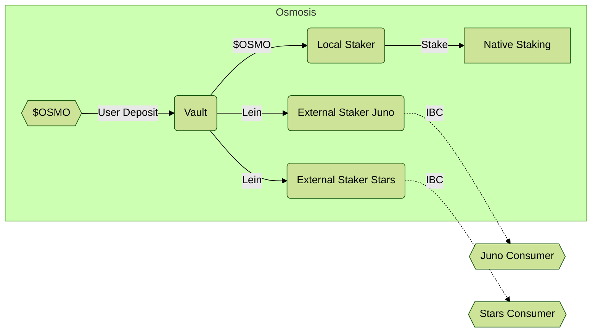
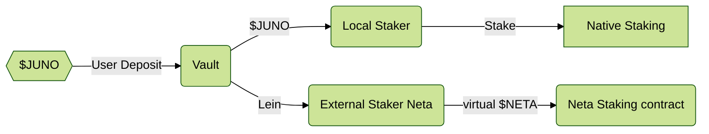
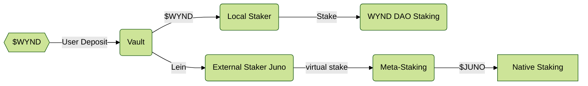

# Provider Overview

Here is a brief overview of the architecture on the provider side
before we dig into the function of each of the components.

The standard case is a vault on the provider chain enabling
staking the native token locally, as well as staking "virtual tokens"
on multiple external chains connected via IBC:

## Flows

The first action the user must undertake is depositing
the native staking token into the vault. This must be liquid
(unbonded and fully vested). This gives them a credit on the vault,
which they can withdraw assuming there are no outstanding leins on that amount.
[Read more about the vault](./Vault.md).

Each vault contains *exactly one* denom and has *exactly one* local staking
module.  This local staker can stake the vault token with the
native staking module.  It actually accepts the original token, which makes
it different than external stakers, which accept leins. By depositing in the vault
and staking in the local staker, I will have achieved the same effect
(and get the same rewards) as directly staking... but I can now use my balance
for more.
[Read more about local staking](./LocalStaking.md).

The external stakers allow us to cross-stake the native vault
token on other chains (or other DAOs) that use a different native
staking token, but have opt-ed in to accepting a portion
of their security from this vault in exchange for a portion
of their rewards. In the basic model, these accept a lein
from the vault and will communicate with a consumer interface
to inform how much stake is locked to which validator and
to receive rewards.
[Read more about external staking](./ExternalStaking.md).

The connection to the consumer is generally over IBC and the consumer is
responsible for converting these "virtual tokens" into delegations
in the native staking module. Note that the consumer must first opt-in to
accept the provider's tokens and can place multiple restrictions and limits
on to how much power can be granted into any external chain.
[Read more about consumers](../consumers/Consumer.md).

## Stakers and Governance

Both [local stakers](./LocalStaking.md) and [external stakers](./ExternalStaking.md)
allow the user to bond to the validator of their choice on the associated chain.
The question arises as to what influence the cross-staked user can have on chain governance.

For MVP, all these delegations provide full governance power to the validator
that was selected, but the cross-staker may not directly vote
on any of these issues (they inherit the validator's vote).
**For MVP, no override of votes**

For local staking (in the native token), the end goal is the cross-staker has the
same governance rights as if they had staked directly and can override
the validator's voice if they request. However, this is relatively complex when
one local staking contract hold delegations from many staker to the same validator,
and takes careful design with weighted votes and probably something
like cron cat to trigger this. 

**We aim to have full participation in local votes by v2**

For external staking, the cross-staker will never be able to override
the vote, as they are not expected to be very active in local governance
on these external protocols. (If they want to participate, they can take the
cross-staking rewards and delegate those tokens directly to get a voice.)

There will be two supported configurations for external staking.
Either the cross-staked tokens provides governance voting power
to the validator in the same proportion that it provides Tendermint voting power.
Or the cross-staked tokens only provide Tendermint voting power (security)
without granting more governance power to that validator.
There are [use cases](../UseCases.md) for each configuration.

**By v2, we will be able to configure if cross-staked tokens provide governance power to the validator**

## DAO DAO Extension

After discussing this general diagram, we realized there is some value in 
a simplified version of this, which may also be a great starting place to
testing out UX without the complications of IBC. DAOs have their own
token, governance, staking, and reward contracts. We can compare them to
low-cap chains embedded in a host chain. Let's look at two ways of using DAOs locally

### Bootstrapping DAOs

When a new DAO launches, it often wants to accomplish two things:
1. Ensure a reasonable security for the DAO (regardless of low market cap)
2. Airdrop some tokens to native stakers.

By using a variant of mesh security, they can do both, acting as a
consumer of security from the native staking tokens to provide a solid
base security amount. And also, providing a share of their rewards
to those $JUNO cross-stakers, effectively airdropping those tokens
(at zero cost to the recipient) for providing some initial security.
It would look like this:

Note that this requires the exact same Vault and Local Staker
as the real use case, and uses the same External Staker interface.
The "Neta Staking" contract is already built and by building out 
this "External Staker Neta" adapter contract, we can work through
all the design issues in a local environment (where we can easy get
coverage with `cw-multi-test`), as well as start building out a
single-chain demo UI, where we can start discovering and resolving
the UX issues in explaining such a system.

This may force a bit more abstraction in the system, as
"external staker Neta" doesn't take a validator as an argument,
it just stakes. Without delegation, this also brings up many questions
about governance power and such, which may be easier to prototype
in DAO contracts than modifying the Cosmos SDK staking module.

**Recommendation** Once the MVP Vault is built, it would be good to assign
one contract dev to work out this External Staker implementation to 
some standard DAO DAO staking contract (can be a "hacked" version that
just holds a lot of the DAO token, like we did in HackWasm Medellin).
This will unblock frontend developers and allow us to get much quicker
feedback on UX issues in such a system, while the backend engineers 
are working with the complexities of IBC and staking virtual tokens in
the native SDK staking module.

We don't develop this to production quality, but use it
as a proof-of-concept to get some hands on feedback on how to deal
with various issues here like different unbonding periods and
what to do about governance power.

### Mega DAOs

If a DAO has a market cap approaching the TVL staked in the native token, this
becomes a dangerous situation for the DAO as the security provisioned by the chain
is insufficient to protect it from attacks. We could turn this model around and allow
the DAO token to "externally stake" on the local staking contract. 

Note this would require a different implementation for vault (to handle cw20),
and likely a different "local staker" interface (you don't select validators, but rather unbonding time).
The "External Staker JUNO" would be similar to the normal [Receiver model](../consumer/Receiver.md)
and we will need a full implementation of the [Consumer side](../consumer/Consumer.md)
implemented on the same chain.

**Recommendation** We do not build this either as MVP or v1, and view later if it makes
sense at all. However, we should consider this use case in our designs to ensure our interfaces
and invariants make this possible.

## Optional Extensions

These won't be included in MVP and require more modifications
to the core Cosmos SDK modules, which makes them more risky and
more difficult to port to other chains. But could be considered
as chain-specific extensions.

* Enable moving bonded tokens directly into the vault? (Custom SDK change)
* Allow depositing vesting tokens to the vault? (deeper SDK change)
